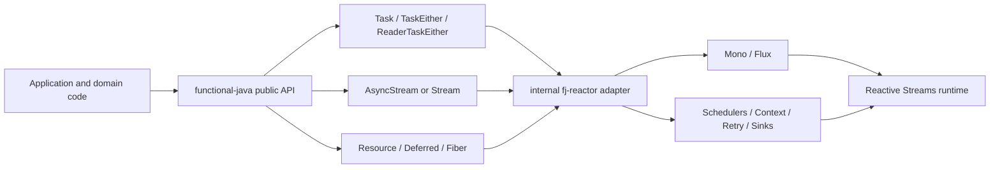
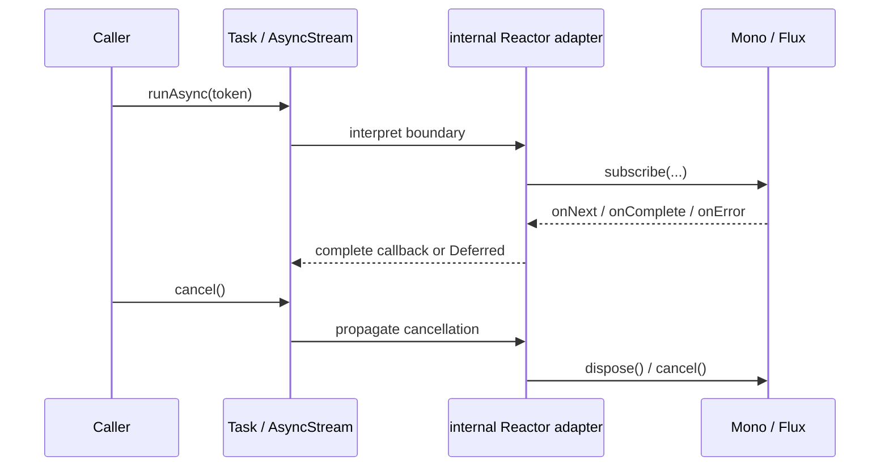

# Mapping Reactor Core into functional-java

## Executive summary

The most important finding is that **functional-java already has most of the right *public* shapes** to hide Reactor behind its own API. In particular, `Task<A>` is the library’s asynchronous effect; `TaskEither<E, A>` adds typed failures; `ReaderTaskEither<R, E, A>` models environment + async + typed errors; and `Stream<F, A>` is already a lazy, effectful, resource-aware stream encoding. That means the integration strategy should be **“Reactor as an internal runtime/adaptor layer”**, not “make Reactor types public”. citeturn10view0turn10view1turn10view6turn12view0turn13view0turn19view2turn20view0

The second finding is that the **current low-level async boundary in functional-java is not yet strong enough to wrap Reactor faithfully**. `Task` is internally driven by `CompletableFuture`, `Task.async(...)` only exposes a success callback, `CancellationToken` is an `AtomicBoolean`-style cooperative token, and `Task.race(...)` does not cancel losers. Those gaps make `Mono`/`Flux` adaptation awkward unless you block, and blocking is exactly what Reactor warns against on its non-blocking schedulers. citeturn10view1turn10view3turn15view0turn15view2turn10view10turn29view1turn29view2

The highest-value additions are therefore **not Reactor-shaped primitives**, but a small set of **effect-runtime primitives** inside functional-java: a cancellable async constructor for `Task`, a first-class `Outcome`/`Fiber` model, a compositional `Resource`, and a one-shot `Deferred`/promise-like primitive. Those are the pieces that let Reactor remain an implementation detail while preserving cancellation, resource safety, and typed error boundaries. Cats Effect’s official `MonadCancel`, `Spawn`, and `Resource` docs are a particularly useful comparative model for these semantics. citeturn38view0turn37view0turn37view4turn37view6

Finally, the right public mapping is **not** one-to-one with Reactor’s nouns. `Mono<A>` should usually surface as `Task<A>`, `TaskEither<E, A>`, or `Task<Maybe<A>>`; `Flux<A>` should surface as a `Task`-specialised stream abstraction; Reactor `Context` should usually be converted to `Reader`/`ReaderTaskEither`; Reactor `Schedulers`, backpressure arithmetic, `Sinks`, and hot/cold mechanics should remain inside adaptors unless the library eventually decides to add explicit hot-stream primitives such as a `Topic<A>`. citeturn26view1turn16view0turn13view0turn39view0turn39view3turn29view0turn42view0turn30view0turn40view3

## What functional-java already provides

The repository exports the packages `codec`, `ds`, `hkt`, `optic`, `parser`, `stream`, `test`, and `typeclass`, and it is built for **Java 21** with existing **JMH**, **TestNG/JUnit**, and **Testcontainers** support. The POM metadata describes the project as a library that provides functional APIs for data structures. That is a good fit for adding an internal Reactor bridge without changing the library’s outward identity. citeturn20view0turn21view0turn21view1turn21view4

The repo structure also shows a clear separation between data structures/effects (`fj.ds`), higher-kinded infrastructure (`fj.hkt`), typeclasses (`fj.typeclass`), streams (`fj.stream`), optics, codecs/parsers, and law/property test helpers. In practice, that means the integration work can stay concentrated in the effect and stream layers rather than spreading through the whole codebase. citeturn4view0turn5view0turn6view1turn6view2turn6view6turn6view7

### Confirmed core abstractions

| Category | Confirmed files / abstractions | Observed role |
|---|---|---|
| Higher-kinded infrastructure | `Higher.java` | Witness type for HKTs. citeturn6view6 |
| Typeclasses | `Applicative`, `Bifunctor`, `Eq`, `Functor`, `Hashable`, `Monad`, `Monoid`, `Ord`, `Profunctor` | Generic functional programming surface already exists. citeturn6view2 |
| Root collection algebra | `Collection<T>` | Core triad of `empty`, `build`, `foldl`, plus `map`, `flatMap`, `traverse`, `sequence`. citeturn17view0turn17view4turn17view5turn17view6turn17view7 |
| Optionality | `Maybe<T>` | Optional value, `some`/`nothing`, `map`, `flatMap`, `orElse`, `either`. citeturn16view0turn16view4turn16view5 |
| Synchronous effects | `IO<A>` | Deferred synchronous side-effect with `map`, `flatMap`, `unsafeRun`. citeturn14view0turn14view3turn14view4 |
| Async effects | `Task<A>` | Async computation backed by `CompletableFuture`, with `map`, `flatMap`, `timeout`, `retry`, `race`, `bracket`, parallel traversal, `runAsync`. citeturn10view0turn10view1turn10view4turn10view6turn11view0turn11view1turn11view2turn11view3 |
| Typed async errors | `TaskEither<E, A>` | Async typed error effect over `Task<Either<E, A>>`. citeturn12view0turn12view4turn12view5 |
| Environment + async + typed errors | `ReaderTaskEither<R, E, A>` | Effect stack for dependency injection plus async typed failure; includes `ask`, `lift`, `map`, `flatMap`, `run`. citeturn13view0turn13view2turn13view3turn13view4turn13view5 |
| Streaming | `Stream<F, A>` | Lazy, effectful stream encoded as `Higher<F, Maybe<Tuple<A, Stream<F, A>>>>`, with `map`, `flatMap`, `bracket`, `onFinalize`, `foldl`, and a `Task`-specific `parEvalMap`. citeturn19view2turn18view7 |
| Cancellation | `CancellationToken` | Cooperative cancellation token with `cancel`, `isCancelled`, `throwIfCancelled`. citeturn15view0turn15view2turn15view3 |
| Law and property testing | `FunctorLaws`, `MonadLaws`, `MonoidLaws`, `Property`, `Gen`, `Shrink` | Existing home-grown law-testing harness can be extended to new effect primitives. citeturn6view7 |

### Strengths relevant to Reactor integration

The good news is that the library already encodes the major *conceptual* layers you need for a Reactor-free public API. `Task` is a natural home for single-result asynchronous computations; `TaskEither` is a natural fit for typed business failures; `ReaderTaskEither` is the right surface for per-request configuration, dependencies, and contextual data; and `Stream<F, A>` is already a better public domain abstraction than `Flux<A>` because it stays library-owned and parametric in the effect type. citeturn10view0turn10view6turn12view0turn13view0turn19view2

The existing resource-safety story is also promising. `Task.bracket(...)` gives a foundational acquire/use/release pattern, and `Stream` already has `bracket(...)` and `onFinalize(...)`, which are close to the operational needs of wrapping Reactor’s `using`, `doFinally`, and cancellation cleanup paths. citeturn11view0turn18view7turn28view2turn28view3

### Confirmed gaps and unspecified areas

The strongest gaps appear in the **effect runtime boundary**, not the higher-level functional surface. `Task.async(...)` only accepts a success callback, so it cannot directly model an externally asynchronous source that may fail later. `CancellationToken` exposes no listener registration, so it cannot directly dispose a Reactor subscription. `Task.race(...)` completes with the first completed future but does not cancel the losing tasks. `Task.retry(...)` is basic and lacks error filters, backoff, or jitter. citeturn10view3turn15view0turn15view2turn10view10turn10view8turn28view4

There is also a stream-level mismatch. `Stream.parEvalMap(int parallelism, ...)` is documented as concurrent evaluation within a stream, but in the visible implementation the `parallelism` argument is not used to govern demand or in-flight concurrency; it is simply threaded through recursion. For Reactor integration, that makes it too weak as a surface equivalent for `flatMap`, `flatMapSequential`, or bounded concurrent stream evaluation. citeturn18view7

Some files are clearly part of the core design but were not fully inspectable from the available GitHub excerpts. Before finalising any public API names, I would directly inspect at least these files: `Reader.java`, `Ref.java`, `State.java`, `Pipe.java`, `Sink.java`, the exact typeclass definitions in `Applicative.java`/`Monad.java`, the law testing files in `fj.test`, and `Tuple` plus any additional `ds` files referenced by `Stream` source but not visible in the excerpted listing. Their presence is indicated by the package listings and by `Stream`’s use of `Tuple`. citeturn6view0turn6view1turn6view2turn19view2

## What Reactor brings that matters here

Project Reactor’s current stable docs page lists **reactor-core 3.8.5** in the **2025.0.5** release train. Reactor Core is built on the Reactive Streams model, whose scope is asynchronous stream processing with **non-blocking back pressure**. On Java 9+, `java.util.concurrent.Flow` is stated to be **1:1 semantically equivalent** to Reactive Streams interfaces, which is relevant because functional-java already targets Java 21. citeturn24view0turn32view0

### Reactor primitives and operational patterns

| Reactor primitive / concern | Official semantics |
|---|---|
| `Mono<T>` | A specialised `Publisher<T>` that emits at most one item and then completes, or emits a single error; `Mono<Void>` is idiomatic for completion-only async work. citeturn26view1 |
| `Flux<T>` | A general-purpose asynchronous sequence of 0..N items with `onNext`, `onComplete`, and `onError`. citeturn26view0 |
| Subscription / cancellation | `subscribe()` returns a `Disposable`; disposal signals cancellation, after which the source should stop and clean up, though cancellation is not always instantaneous. `BaseSubscriber` gives explicit `request(...)`/`cancel()` control. citeturn41view0turn42view0turn42view2 |
| Backpressure | Demand is upstream `request(...)`; default subscribe variants are unbounded, while operators such as `buffer`, prefetching inner operators, `limitRate`, and `limitRequest` reshape demand. citeturn42view0turn42view3turn42view4turn42view5 |
| Threading | Reactor is concurrency-agnostic; `publishOn` moves downstream execution, `subscribeOn` moves subscription/request execution; `Schedulers` offers `immediate`, `single`, `boundedElastic`, `parallel`, and custom schedulers. citeturn26view2turn29view0turn29view4turn29view5 |
| Error handling | Reactor has `onErrorReturn`, `onErrorComplete`, `onErrorResume`, `onErrorMap`, `retry`, and `retryWhen`/`Retry` for selective and backoff-based recovery. citeturn28view0turn28view1turn28view4 |
| Programmatic creation | `generate`, `create`, and `push` expose sink-based creation APIs; `create`/`push` also support cancellation hooks via `onCancel`/`onDispose`. citeturn43view0 |
| Hot vs cold | Cold publishers generate anew per subscriber. Hot publishers can emit before or independently of subscribers. `just` is assembly-time capture, `defer` restores subscription-time behaviour, and `share`/`replay` make cold publishers hot. citeturn40view3turn40view4 |
| Sinks | `Sinks.One`/`Empty` are one-shot Mono-like producers; `Sinks.Many` flavours cover unicast, multicast, best-effort/drop strategies, and replay. citeturn30view0turn30view1turn30view4 |
| Context | Reactor `Context` is immutable, subscriber-scoped, and propagated through subscription; it is read via `deferContextual`/`transformDeferredContextual` and written with `contextWrite(...)`. citeturn39view0turn39view3turn39view5 |
| Resource cleanup | `doFinally`, `using`, `doOnDiscard`, `onOperatorError`, and `onNextDropped` together cover success/error/cancel cleanup and discarded-data cleanup. citeturn28view2turn28view3turn31view0turn31view4 |
| Testing / debugging | `StepVerifier`, `withVirtualTime`, `Hooks.onOperatorDebug()`, and `checkpoint(...)` are the core tools. citeturn27view5turn27view6turn27view7turn27view8 |

### Why these semantics matter for a functional-java integration

The key point is that Reactor is **not just an async callback library**. It carries rich semantics around demand, cancellation, scope, subscriber-local context, hot/cold behaviour, and cleanup. If functional-java wants Reactor to remain an implementation detail, the library needs to either **preserve those semantics explicitly** or **intentionally choose narrower public semantics** and document the loss. That design choice must be made per concept, not globally. citeturn32view0turn42view0turn39view3turn40view3turn31view0

In practice, that means single-result Reactor computations are relatively easy to hide behind `Task`/`TaskEither`, but multi-result push/pull workflows, hot publishers, and subscriber-local context require more deliberate modelling. That is why the mapping below treats `Mono`, `Flux`, backpressure, context, and hot sources differently rather than trying to collapse everything into a single effect type. citeturn26view1turn26view0turn39view3turn40view3

## Concept mapping and adapter sketches

The recommended architecture is shown below. The important design decision is that **all public application code depends only on functional-java types**, while Reactor stays in an unexported adaptor layer.



That shape fits the repo because the library already owns the effect and stream abstractions, while Reactor itself is just a particular implementation/runtime choice. citeturn10view0turn12view0turn13view0turn19view2turn20view0

### Side-by-side mapping

| Reactor concept | Best functional-java public surface | Current fit | Rationale and decision | API sketch |
|---|---|---|---|---|
| `Mono<A>` where absence is impossible | `Task<A>` | Good, but low-level adaptor missing | `Mono` is a 0..1 async publisher; `Task` is already the repo’s async effect with `map`, `flatMap`, and `runAsync`. Wrap `Mono` internally and return `Task`. citeturn26view1turn10view0turn10view6 | `Task<User> fetchUser(Id id)` |
| `Mono<A>` that may complete empty | `Task<Maybe<A>>` | Good conceptual fit | Empty completion should surface as `Maybe.nothing()`, not `null`; Reactor sequences disallow `null`, and `Maybe` already models optionality. citeturn26view1turn43view0turn16view0turn16view4 | `Task<Maybe<User>> findUser(Id id)` |
| `Mono<Void>` | `Task<Void>` or a future `Unit` alias | Good | Reactor explicitly treats `Mono<Void>` as completion-only async work; `Task<Void>` is sufficient unless the library later wants a `Unit` type. citeturn26view1turn10view0 | `Task<Void> persist(Aggregate a)` |
| `Mono<A>` with domain-level errors | `TaskEither<E, A>` | Good public shape | Keep `Throwable` to Reactor/internal infrastructure and map it to typed public failures as close to the adaptor as possible. `TaskEither` already wraps `Task<Either<E, A>>`. citeturn12view0turn12view4turn28view1 | `TaskEither<DomainError, User> load(Id id)` |
| Subscription-time context | `ReaderTaskEither<R, E, A>` or `Reader<R, AsyncStream<A>>` | Good for single-result work | Reactor `Context` is immutable and subscriber-scoped; `ReaderTaskEither.ask()` already exposes explicit environment passing and is the cleanest public replacement for Reactor-specific context APIs. citeturn39view0turn39view3turn13view0 | `ReaderTaskEither<RequestCtx, E, A>` |
| `Flux<A>` | **Proposed** `AsyncStream<A>` over `Stream<Task.µ, A>` | Moderate; generic `Stream` exists, ergonomics missing | `Flux` is 0..N; `Stream<F, A>` is already a lazy step encoding with `bracket` and `onFinalize`. A small `AsyncStream<A>` wrapper would hide the `Task.µ` witness and improve ergonomics while keeping Reactor out of signatures. citeturn26view0turn19view2turn18view7 | `AsyncStream<Event> events()` |
| `Disposable` / `Subscription.cancel` | Existing `CancellationToken` + **proposed** `Fiber`/`Outcome` | Weak today | Reactor uses disposal/cancel as a first-class terminal path; current `CancellationToken` is only polling-based, so it cannot *actively* dispose an upstream subscription without extension. citeturn41view0turn42view0turn15view0turn15view2 | `Fiber<A> f = task.start(); f.cancel();` |
| `using`, `doFinally`, cleanup hooks | `Task.bracket`, `Stream.bracket`, `Stream.onFinalize`, **proposed** `Resource<A>` | Strong base, compositional wrapper missing | Reactor and fj already share the idea of deterministic finalisation, but `Resource` would make nested acquisition/release compositional and law-like rather than ad hoc. citeturn11view0turn18view7turn28view2turn28view3turn37view4turn37view6 | `Resource<Conn> conn = Resource.make(...);` |
| `onErrorReturn`, `onErrorResume`, `onErrorMap`, `retryWhen` | `TaskEither` + **proposed** `recover`, `recoverWith`, `mapError`, `RetryPolicy` | Partial today | `Task.retry` exists, but Reactor’s retry model includes selective retry, companion-state, and backoff policies. Wrap those concepts in library-owned values instead of exposing `Retry`. citeturn28view0turn28view1turn28view4turn10view8 | `task.retry(policy)` |
| `Scheduler`, `publishOn`, `subscribeOn` | JDK `Executor` plus **proposed** execution combinators | Partial today | Reactor is concurrency-agnostic and switches execution with `publishOn`/`subscribeOn`; `Task.of(..., Executor)` is a start, but effect-level execution combinators are still missing. citeturn26view2turn29view4turn29view5turn10view3 | `task.evalOn(ioExecutor)` |
| `Sinks.One` / `Sinks.Empty` | **Proposed** `Deferred<A>` | Missing | `Sinks.One` behaves like a one-shot completion cell and is a good conceptual match for a `Deferred<A>`/promise primitive. citeturn30view0turn36view0 | `Deferred<A> gate` |
| `Sinks.Many`, hot multicast sources | **Proposed later** `Topic<A>` / `Hub<A>` | Missing | Current `Task` and `Stream` are best treated as cold abstractions. If the library needs hot/broadcast semantics, expose them explicitly rather than smuggling them through `Stream`. citeturn30view1turn40view3 | `Topic<A> updates` |
| Demand / `request` / prefetch / `limitRate` | Internal adaptor detail, optional future `Chunk` API | Missing publicly by design | Demand arithmetic belongs inside the Reactor bridge. If a public capability is needed later, prefer chunked pull APIs over leaking Reactive Streams request maths. citeturn42view0turn42view3turn42view4turn42view5 | internal |

### Operator-family correspondence

| Reactor operator family | Current or proposed functional-java equivalent | Comment |
|---|---|---|
| `map` | `map` on `IO`, `Task`, `TaskEither`, `ReaderTaskEither`, `Stream` | Direct correspondence. citeturn14view4turn12view1turn13view3turn18view5 |
| `flatMap` | `flatMap` on all of the above | Direct correspondence for effect sequencing. citeturn12view3turn13view4turn18view7 |
| `concat`, `then`, sequential composition | `Task.flatMap`, `Task.sequenceSequential`, `Stream.concat` | Good fit; preserve ordering. citeturn11view4turn18view7turn25view2 |
| `zip` | `Task.liftA2`; **proposed** `AsyncStream.zip` | Singles are covered; stream zipping still needs a higher-level wrapper. citeturn9view0turn25view2 |
| `merge`, `flatMap` with async inner publishers | `Task.parTraverse` for single-result fan-out; **proposed** stream merge/mergeMap | Current stream surface is too weak for rich Flux-style concurrent merging. citeturn11view1turn18view7turn25view2 |
| `timeout` | `Task.timeout` | Already present. citeturn9view0 |
| `retry`, `retryWhen` | `Task.retry` now; **proposed** `RetryPolicy` for richer behaviour | Existing implementation is much simpler than Reactor’s `Retry`. citeturn10view8turn28view4 |
| `using`, `doFinally` | `Task.bracket`, `Stream.bracket`, `Stream.onFinalize`, **proposed** `Resource.use` | Strong conceptual overlap. citeturn11view0turn18view7turn28view2turn28view3 |
| `contextWrite`, `deferContextual` | Construct `Reader...` at the boundary; optional future `Local` | Make context explicit in public code. citeturn39view3turn39view4turn39view5 |
| `publishOn`, `subscribeOn` | `evalOn`, `subscribeOn` over `Executor` | Needed, but should remain library-owned names. citeturn29view4turn29view5 |
| `collectList`, `reduce`, `scan` | `Stream.foldl`, `Collection` folds, `Task` accumulation | Keep collection collapse explicit and optional. citeturn18view7turn17view3turn25view2 |

### Adapter flow



This flow is the reason a richer cancellation API is essential: the public functional-java effect needs an internal way to translate its cancellation event into Reactor’s `dispose()`/`cancel()` semantics. citeturn41view0turn42view0turn15view0

### Example adaptor sketches

The adaptor sketches below intentionally treat Reactor as a private dependency. They rely on **proposed** low-level additions such as `Task.asyncCancelable(...)`, `CancellationToken.onCancel(...)`, and an ergonomic `AsyncStream<A>` wrapper.

A first sketch for `Mono<A>` to `Task<A>`:

```java
package io.github.senthilganeshs.fj.reactor.internal;

import io.github.senthilganeshs.fj.ds.CancellationToken;
import io.github.senthilganeshs.fj.ds.Either;
import io.github.senthilganeshs.fj.ds.Maybe;
import io.github.senthilganeshs.fj.ds.Task;
import reactor.core.Disposable;
import reactor.core.publisher.Mono;

public final class ReactorTaskAdapters {

    private ReactorTaskAdapters() {}

    public static <A> Task<A> fromMono(Mono<A> source) {
        return Task.asyncCancelable((callback, token) -> {
            Disposable disposable = source.subscribe(
                callback::success,
                callback::failure,
                () -> {}
            );

            token.onCancel(disposable::dispose);
            return disposable::dispose;
        });
    }

    public static <A> Task<Maybe<A>> fromMonoMaybe(Mono<A> source) {
        return fromMono(
            source.map(Maybe::some)
                  .switchIfEmpty(Mono.just(Maybe.nothing()))
        );
    }
}
```

This shape is preferable to `Task.of(() -> mono.block())`, because Reactor explicitly warns that blocking APIs such as `block()`, `blockFirst()`, and `blockLast()` are illegal on its default `single` and `parallel` schedulers, and because cancellation/disposal should remain live rather than being erased into a blocking call. citeturn29view1turn29view2turn41view0

A sketch for mapping Reactor failures into typed public failures:

```java
public static <E, A> TaskEither<E, A> fromMonoEither(
    Mono<A> source,
    java.util.function.Function<Throwable, E> mapError
) {
    return TaskEither.of(
        fromMono(source)
            .map(Either::<E, A>right)
            .recover(error -> Either.left(mapError.apply(error)))
    );
}
```

That approach keeps `Throwable` inside the infrastructure boundary and presents `TaskEither<E, A>` to consumers, which is consistent with the existing role of `TaskEither` in the repo. citeturn12view0turn12view4turn28view1

A sketch for a public service API that uses `ReaderTaskEither` as the exposed shape and Reactor `Context` only internally:

```java
public interface UserAlgebra {
    ReaderTaskEither<RequestCtx, DomainError, User> getUser(String id);
}

final class ReactorUserAlgebra implements UserAlgebra {

    private final ReactorUserClient client; // internal-only dependency

    ReactorUserAlgebra(ReactorUserClient client) {
        this.client = client;
    }

    @Override
    public ReaderTaskEither<RequestCtx, DomainError, User> getUser(String id) {
        return new ReaderTaskEither<>(new Reader<>(ctx ->
            ReactorTaskAdapters.fromMonoEither(
                client.fetchUser(id)
                      .contextWrite(rc -> rc.put("correlationId", ctx.correlationId())),
                DomainError::fromThrowable
            ).map(dto -> User.fromDto(dto))
        ));
    }
}
```

That mapping is attractive because Reactor `Context` is subscriber-scoped and immutable, while `ReaderTaskEither` already gives you an explicit subscription-time environment. It also keeps correlation IDs, auth, tenancy, and tracing concerns out of domain method signatures that would otherwise need to talk about Reactor. citeturn39view0turn39view3turn39view4turn13view0

For `Flux<A>`, I would **not** expose `Flux` publicly. I would add an ergonomic `AsyncStream<A>` wrapper over `Stream<Task.µ, A>` and adapt Reactor behind it:

```java
public record AsyncStream<A>(Stream<Task.µ, A> value) {

    public <B> AsyncStream<B> map(Function<A, B> fn) {
        return new AsyncStream<>(value.map(fn, Task.monad));
    }

    public <B> AsyncStream<B> flatMap(Function<A, AsyncStream<B>> fn) {
        return new AsyncStream<>(
            value.flatMap(a -> fn.apply(a).value(), Task.monad)
        );
    }

    public Task<List<A>> toList() {
        return Task.narrowK(value.foldl(List.nil(), List::build, Task.monad));
    }
}
```

Then the internal Reactor bridge can preserve backpressure and cancellation without leaking Reactor’s vocabulary:

```java
public final class ReactorStreamAdapters {

    private ReactorStreamAdapters() {}

    public static <A> AsyncStream<A> fromFlux(Flux<A> flux) {
        return AsyncStream.bracket(
            Task.of(() -> new FluxCursor<>(flux)),
            cursor -> AsyncStream.unfoldTask(cursor, FluxCursor::pull),
            FluxCursor::close
        );
    }
}
```

The detail that matters is *not* the exact adaptor class names; it is that the public abstraction stays library-owned and that the adaptor preserves demand and cancellation rather than collapsing every `Flux` to `Task<List<A>>`. Reactor’s own documentation makes clear that request, prefetch, `limitRate`, and cancellation semantics are significant, so blindly collecting to a list would destroy one of the strongest reasons to use Reactor in the first place. citeturn42view0turn42view3turn42view4turn42view5

## New primitives to add

My recommendation is to add a **small, law-governed effect kernel** to functional-java and let Reactor implement *that* kernel internally. The design centre should be semantics, not brand names.

### A cancellable async constructor for Task

This is the single most important addition. Without it, wrapping `Mono` or callback APIs forces you toward blocking or half-faithful encodings.

A minimal design could be:

```java
public interface Callback<A> {
    void success(A value);
    void failure(Throwable error);
}

public interface Canceler {
    void cancel();
    static Canceler noop() { return () -> {}; }
}

public static <A> Task<A> asyncCancelable(
    java.util.function.BiFunction<Callback<A>, CancellationToken, Canceler> register
)
```

The intended semantics should be:

- **deferred registration**: the Reactor subscription or callback registration happens only when the `Task` is interpreted;
- **single terminal signal wins**: success, failure, and cancellation race safely but only one outcome becomes visible;
- **cancellation is idempotent**: multiple cancels collapse to one observable cancellation;
- **no hidden blocking**: wrapping an async source must not call `block()` or equivalent. citeturn10view3turn41view0turn29view1turn29view2

This primitive is also where I would place `fromCompletionStage(...)` and `defer(...)`/`suspend(...)`. Reactor’s hot/cold docs make it clear that subscription-time deferral matters. If functional-java wants to preserve that lawfully, it needs its own `defer` constructor rather than relying on ad hoc Java suppliers. citeturn40view3turn40view4

### Stronger cancellation plus Outcome and Fiber

Current cancellation is too weak for Reactor interop because it is only a boolean token. Reactor cancellation is an operational event that should dispose subscriptions, trigger finalisers, and be distinguishable from failure. Cats Effect’s `Outcome`/`Fiber` model is a strong comparative reference here. citeturn15view0turn41view0turn38view0turn37view0

A good functional-java surface would be:

```java
public sealed interface Outcome<E, A> {
    record Succeeded<E, A>(A value) implements Outcome<E, A> {}
    record Failed<E, A>(E error) implements Outcome<E, A> {}
    record Cancelled<E, A>() implements Outcome<E, A> {}
}

public interface Fiber<E, A> {
    Task<Outcome<E, A>> join();
    Task<Void> cancel();
}
```

And `CancellationToken` itself should grow listener registration:

```java
public final class CancellationToken {
    public boolean isCancelled();
    public boolean cancel();
    public void throwIfCancelled();
    public void onCancel(Runnable listener);
}
```

That change would immediately improve `Task.race` as well. Today, `Task.race(...)` returns the first completed value but does not cancel the losing tasks. For Reactor-backed tasks this is a resource-leak risk, because losing subscriptions may continue to run. A `Fiber`-based race can cancel losers deterministically. citeturn10view10turn41view0

### A compositional Resource abstraction

The repo already has `Task.bracket(...)` and `Stream.bracket(...)`, which is excellent. What it lacks is a first-class, compositional resource datatype comparable to Cats Effect’s `Resource`, whose official docs emphasise reverse-order release, non-interruptible acquire/release, and prompt finalisation at `use` scope end. citeturn11view0turn18view7turn37view4turn37view6

A minimal Java shape could be:

```java
public final class Resource<A> {

    public static <A> Resource<A> make(
        Task<A> acquire,
        java.util.function.Function<A, Task<Void>> release
    ) { ... }

    public <B> Task<B> use(java.util.function.Function<A, Task<B>> f) { ... }

    public <B> Resource<B> map(java.util.function.Function<A, B> f) { ... }

    public <B> Resource<B> flatMap(java.util.function.Function<A, Resource<B>> f) { ... }
}
```

This would give functional-java a clean public equivalent for Reactor’s `using`, `doFinally`, `onDispose`, and many forms of subscription-scoped cleanup. It would also make it easier to hide Reactor `Context`, scheduler scopes, or `Disposable` lifecycles inside acquisition/release blocks. citeturn28view2turn28view3turn43view0turn37view4

### Deferred for one-shot coordination

A one-shot promise/deferred cell is extremely useful for adapting callback APIs, `Mono`, and internal stream bridges. Reactor’s `Sinks.One` is effectively a Mono-like one-shot producer; Cats Effect’s standard library also includes `Deferred`. A functional-java-owned version would prevent Reactor’s sink APIs from leaking upward. citeturn30view0turn36view0

A practical API would be:

```java
public interface Deferred<A> {
    Task<A> get();
    Task<Void> complete(A value);
    Maybe<A> tryGet();
}
```

Laws and semantics:

- exactly one successful completion;
- `get()` is async-waiting, not blocking;
- `complete` after completion is idempotent or returns a typed failure;
- cancellation of a waiting `get()` does not corrupt the cell.

This primitive also unlocks a more faithful `Flux -> AsyncStream` bridge, because you can turn pushed `onNext`/`onError`/`onComplete` signals into pullable step transitions. citeturn43view0turn42view0

### AsyncStream as an ergonomic wrapper

`Stream<F, A>` is already a sound core abstraction, but its HKT witness makes it awkward as a direct user-facing replacement for `Flux<A>`. I therefore recommend a **very thin** wrapper:

```java
public record AsyncStream<A>(Stream<Task.µ, A> value) { ... }
```

This is not a new semantic primitive so much as an ergonomic public façade. It would let service and repository APIs say `AsyncStream<Event>` instead of `Stream<Task.µ, Event>`, while still reusing the generic `Stream` implementation internally. Because Reactor `Flux` is 0..N and `Stream<F, A>` is already a lazy step encoding with finalisation hooks, this is a natural match. citeturn26view0turn19view2turn18view7

I would also consider adding:

```java
public static <A, S> AsyncStream<A> unfoldTask(
    S initial,
    java.util.function.Function<S, Task<Maybe<Tuple<A, S>>>> pull
)
```

That single constructor makes it much easier to encode a backpressure-aware Reactor cursor internally.

### Context and environment

Reactor `Context` is powerful, but it is also Reactor-specific. The default integration choice should be to map it to **explicit environment passing** through `Reader`/`ReaderTaskEither`, because that preserves portability, testability, and lawfulness. Reactor itself notes that context is tied to each subscriber, immutable, and populated at subscription time via `contextWrite(...)`. That is very close to the semantics of “provide an environment when you run the effect”. citeturn39view0turn39view3turn39view4

So the recommendation is:

- for single-result APIs, use `ReaderTaskEither<R, E, A>`;
- for streams, use `Reader<R, AsyncStream<A>>` or add a convenience `ReaderAsyncStream<R, A>` later if this pattern is common;
- only add a dedicated `Local<R, A>`/effect-local context primitive if you truly need nested-scoped context mutation analogous to multiple `contextWrite(...)` calls.

### Hot sources and hubs

I would **not** add hot-stream abstractions in the first migration milestone. Current `Task` and `Stream` are best treated as cold, subscription-driven abstractions. Reactor’s own docs distinguish hot from cold very clearly, and `Sinks.Many` carries policy choices around multicast behaviour, buffering, replay, and slow subscribers. If you need such semantics publicly later, expose them explicitly as `Topic<A>` or `Hub<A>` rather than overloading `AsyncStream<A>`. citeturn40view3turn30view1turn30view4

A later-stage API could be:

```java
public interface Topic<A> {
    Task<Void> publish(A value);
    AsyncStream<A> subscribe();
}
```

But I would defer this until there is a concrete need.

## Operational concerns

### Performance and allocation profile

The existing `Task` uses a `Function<Maybe<CancellationToken>, CompletableFuture<A>>` internally, and `Task.of(...)` delegates to `CompletableFuture.supplyAsync(...)`, optionally with an `Executor`. For single-result Reactor integration, that means an internal bridge can be efficient enough if it completes a `Task` via callback registration rather than by blocking. Forcing Reactor through `block()` would both destroy liveness and add scheduler contention, especially because Reactor’s default `single` and `parallel` schedulers reject blocking calls. citeturn10view1turn10view3turn29view1turn29view2

For streaming, the main performance risk is **erasing backpressure by collecting eagerly**. Reactor’s documentation shows that demand, prefetch, and `limitRate` are not incidental details; they are core operational semantics. The adaptor from `Flux` to `AsyncStream` should therefore be stepwise and demand-aware. If throughput later becomes a concern, the public evolution path should be toward **chunked pulls** rather than toward exposing Reactor’s `request` mechanics directly. citeturn42view0turn42view3turn42view4turn42view5

### Threading and scheduler boundaries

Reactor is concurrency-agnostic, and it distinguishes `publishOn` from `subscribeOn`: the former moves downstream execution, while the latter moves subscription/request execution. Existing `Task.of(..., Executor)` only partially addresses this, because it specifies where a supplier starts, not a general effect-level execution model across an operator chain. The public surface should therefore use library-owned names such as `evalOn(Executor)` and `subscribeOn(Executor)` or an `ExecutionContext` wrapper, while the internal Reactor bridge decides whether these correspond to Reactor schedulers, plain executors, or both. citeturn29view4turn29view5turn10view3

There is a second subtle threading concern: Reactor’s hot/cold model means that `Mono.just(...)` captures a value at assembly time, while `defer(...)` recreates subscription-time laziness. Public functional abstractions should preserve **subscription-time semantics by default**, so adaptors should prefer Reactor `defer` internally where necessary rather than accidentally capturing values too early. citeturn40view3turn40view4

### Cancellation and resource safety

Reactor treats cancellation as an essential path alongside completion and error. Its docs explicitly connect `doFinally` to completion, error, or cancellation, and they note that operators with internal backpressure queues often use `doOnDiscard` during cancellation to clean up buffered-but-unemitted elements. That is a strong argument for making cancellation a first-class, observable outcome in functional-java rather than smuggling it through `Throwable`. citeturn28view2turn31view0

This is also why `Resource` should be prioritised over a collection of ad hoc callbacks. Compositional acquire/use/release is the cleanest way to guarantee cleanup across success, failure, and cancellation, and it aligns both with the existing `Task.bracket`/`Stream.bracket` design and with mature effect-system practice. citeturn11view0turn18view7turn37view4turn37view6

### Debugging

For debugging, Reactor’s own guidance is to use assembly-time instrumentation (`Hooks.onOperatorDebug()`) sparingly and early, and to prefer targeted `checkpoint(...)` markers when you want narrower and lower-overhead traceability. In a functional-java integration, that suggests a split approach:

- keep **Reactor-specific debugging** inside the internal adaptor module;
- add **public tracing/debug hooks** to `Task`/`AsyncStream` only if they can stay implementation-neutral;
- use stable correlation IDs and explicit `Reader` environments for request tracing rather than relying on Reactor `Context` in public code. citeturn27view7turn27view8turn39view2

### Testing strategy

The repo is already set up with law/property testing helpers and JMH. Reactor adds `StepVerifier` and virtual time. The most robust strategy is therefore a layered test approach:

| Test layer | What to verify | Suggested tools |
|---|---|---|
| Public lawfulness | Functor/Monad laws for new wrappers, plus `Resource` and `Deferred` invariants | Existing `fj.test` harness. citeturn6view7 |
| Adaptor correctness | Reactor signal translation, cancellation propagation, empty-vs-value mapping, error mapping | `reactor-test` `StepVerifier`. citeturn26view8turn27view5 |
| Time-sensitive logic | timeout, retries, delayed emission, scheduled switching | `StepVerifier.withVirtualTime`. citeturn27view6 |
| Resource safety | Finalisers under success, failure, and cancel; discard cleanup where relevant | Integration tests with explicit cancellation and cleanup counters. citeturn28view2turn31view0 |
| Performance | single-shot `Mono -> Task`, stream throughput, cancellation latency, backpressure overhead | Existing JMH plugin in the build. citeturn21view0turn21view3 |

A particularly important regression test is “**no public adaptor blocks**”. That should be enforced both by code review and by tests that run on Reactor scheduler threads where misuse of `block()` would fail fast. citeturn29view1turn29view2

## Recommended roadmap

The roadmap below assumes the goal is to keep Reactor strictly internal while producing a stable functional-java-first public API. Effort estimates are rough engineering estimates for one experienced maintainer working primarily in this codebase.

| Priority | Item | Why it comes early | Estimated effort |
|---|---|---|---|
| Highest | Add `Task.defer(...)` and `Task.asyncCancelable(...)` | This is the enabling step. Without it, non-blocking faithful `Mono`/callback adaptation is not possible. | 3–5 days |
| Highest | Enrich `CancellationToken`; add `Outcome` and `Fiber` | Required to translate Reactor cancellation/disposal into library-owned semantics and to fix `race`/parallel composition cleanly. | 4–6 days |
| Highest | Add internal `fj-reactor` adaptor package/module | Keeps Reactor out of exported packages and enables parallel development of adaptors without public API churn. | 1–2 days |
| High | Implement `Mono -> Task`, `Mono -> Task<Maybe<A>>`, `Mono -> TaskEither<E, A>` adaptors | Covers the most common service/repository use-cases immediately. | 2–4 days |
| High | Add compositional `Resource<A>` | Needed for reliable cleanup and for a principled replacement of `using`/`doFinally`. | 3–5 days |
| High | Add `Deferred<A>` | Simplifies callback bridges and makes the later `Flux -> AsyncStream` adaptor much cleaner. | 2–4 days |
| High | Add ergonomic `AsyncStream<A>` wrapper over `Stream<Task.µ, A>` | Makes a `Flux` replacement pleasant to use without leaking HKT witnesses or Reactor. | 2–3 days |
| Medium | Implement `Flux -> AsyncStream<A>` adaptor with demand-aware pull bridge | This is the hardest technical adaptor because it must preserve streaming, cancellation, and sensible demand behaviour. | 5–8 days |
| Medium | Add richer recovery/retry API (`recover`, `recoverWith`, `RetryPolicy`) | Needed to replace `onErrorResume`/`retryWhen` with library-owned policies. | 3–5 days |
| Medium | Review and strengthen `Task.race` and `Stream.parEvalMap` semantics | Existing implementations are weaker than Reactor’s cancellation and concurrency expectations. | 3–5 days |
| Later | Add optional context-local abstraction if `Reader...` proves insufficient | Only worth it if nested-scoped context mutation becomes a recurring pattern. | 2–4 days |
| Later | Add optional hot primitives like `Topic<A>` / `Hub<A>` | Useful only if hot/multicast semantics escape infrastructure concerns. | 4–7 days |

### A practical migration path

The migration itself should be incremental.

First, add the new low-level primitives (`asyncCancelable`, stronger cancellation, `Outcome`, `Fiber`, `Resource`, `Deferred`) and ship them without any Reactor dependency in exported APIs. That is the semantic foundation. This phase is the real risk reducer. citeturn10view3turn15view0turn11view0turn37view4

Second, introduce a **non-exported** Reactor adaptor layer and start converting the easiest single-result boundaries first: replace any public `Mono<A>` with `Task<A>`, any possibly-empty `Mono<A>` with `Task<Maybe<A>>`, and any domain-level failureing `Mono<A>` with `TaskEither<E, A>`. Use `ReaderTaskEither<R, E, A>` where Reactor `Context` or external dependencies are currently doing too much implicit work. citeturn26view1turn16view0turn12view0turn13view0turn39view3

Third, add `AsyncStream<A>` and only then migrate public `Flux<A>` boundaries. Do **not** start by converting `Flux` to `Task<List<A>>` unless the public semantics are truly batch-oriented; doing so throws away Reactor’s streaming and backpressure characteristics and makes later correction more painful. citeturn26view0turn42view0turn42view3turn42view4

Fourth, once the adaptor layer is stable, add thorough adaptor tests with `StepVerifier` and law tests for the public wrappers, then benchmark the critical paths with the build’s existing JMH setup. Only after single-result and streaming boundaries are solid should you consider optional higher-level additions such as `Topic<A>` or richer context-local features. citeturn26view8turn27view5turn6view7turn21view0turn21view3

### Recommended end state

The target design I would recommend is this:

- **public single-shot APIs** return `Task<A>`, `TaskEither<E, A>`, or `ReaderTaskEither<R, E, A>`;
- **public streaming APIs** return `AsyncStream<A>` or `Reader<R, AsyncStream<A>>`;
- **public resourceful APIs** use `Resource<A>`;
- **public coordination/concurrency APIs** use `Deferred<A>`, `Fiber<E, A>`, and `Outcome<E, A>`;
- **Reactor remains internal**, used only to *implement* these abstractions. If a general JVM streaming escape hatch is ever necessary, prefer `Flow.Publisher` over Reactor-specific public types because Java `Flow` and Reactive Streams are semantically equivalent and the repo already targets Java 21. citeturn32view0turn21view4

That end state keeps functional-java in control of its semantics and API design, minimises vendor lock-in to Reactor, and still lets Reactor provide a powerful implementation engine for asynchronous effects and streaming. It also aligns well with the abstractions the repository already has today, which means the integration can be evolutionary rather than a rewrite. citeturn10view0turn12view0turn13view0turn19view2